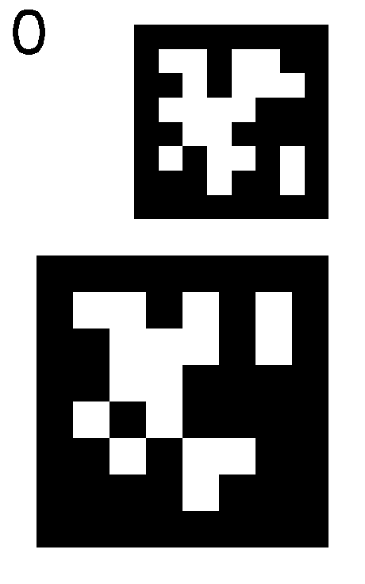
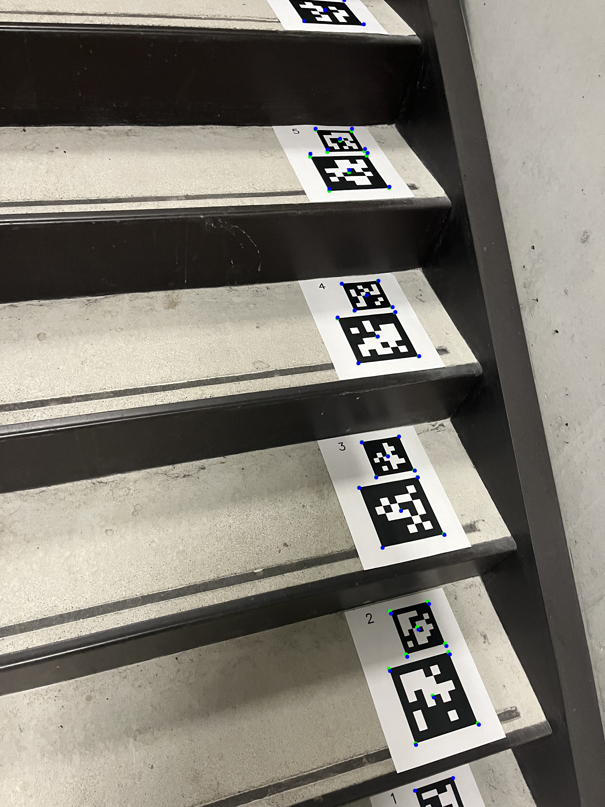
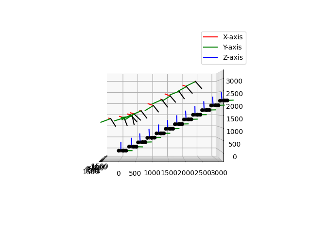

# AprilTag Bundle Adjustment

Implemented as practice after taking ROB501 at the University of Toronto.

A simplified version of the general structure from motion (SFM) problem where we find features using AprilTags instead of a feature detector like ORB. This also gives us a physical prior on the distance between features allowing us to recover absolute scale.

**Requires >=Python3.10**

## Calibration:
This project uses opencv calibration as described in this [document](https://docs.opencv.org/4.x/dc/dbb/tutorial_py_calibration.html). The code is taken directly from that page and is simply wrapped in a nicer way.

If you want to use the calibration script, a chess board calibration target is required.

Note that for the bundle adjustment to be effective, this step must be done very carefully. Ensure that you are not forgetting to take views of the target from far away and placing the target near the edge of the camera. Failure to do this will result in much faster accumulation of errors AprilTags cover large distances.

To reproduce the example calibration, run the command:
*Note that the calibration images supplied here are not the full set so the performance will be degraded from the originally supplied calibration file*
```bash
python calibrate.py \
    --cal-img-dir "./examples/calibration_photos" \
    --pattern-shape 7 9 \
    --out-file "./examples/calibration_iphone_13_vertical.npz" \
    --cal-img-file-type jpg \
    --checker-size-mm 20
```

## Tag Generation
The SFM script accepts 2 types of april tag inputs:
1. A single AprilTag per "feature". This is the standard way AprilTags are used, but at longer distances or with lower resolution cameras, this method can lead to pose ambiguity and the bundle adjustment step may get stuck in a local minimum. If you are using this method, you can print out any AprilTags you want from the internet.
2. Two AprilTags that are together interpreted as a single "feature". This leads to better performance and reduces the probability of pose ambiguity. However, you have to use my script to generate the exact geometry that the bundle adjustment script expects.

A selection of already created tag groups can be found in the `examples/tag_groups` folder.


These groups are sized such that when printed the larger AprilTag will be exactly 130mm from corner to corner. The tag group number is printed in the top left corner and is used to define the base frame in the bundle adjustment script.

To reproduce these images, run the command:
```bash
python tag_group_generator.py \
    --out-dir "./examples/tag_groups" \
    --num-groups 30 \
    --center-scale 3 \
    --outer-scale 2 \
    --dpi 72 \
    --tag-size-mm 130
```

## Bundle Adjustment
One you have created a calibration file for your camera and placed your AprilTags on the surfaces you wish to measure you should photograph the tags multiple times from multiple angles. It is best to have some photos close up to the tags with only a couple tags in view and some far away getting a global view of the tags. This helps to prevent accumulation of errors over time while retaining the accuracy of close up photos. It's kinda the whole point of doing bundle adjustment in the first place.

After running the bundle adjustment script, the input images will be copied to the output folder and annotated with both the true pixel location of the AprilTag corners and the reprojected corners based on the refined tag and camera poses.

We can see that the reprojected corners are mostly correct near the center of the images, but there is generally significant error around the edges. This is most likely due to the camera calibration not being perfect.



We can also see error accumulation in these test photos. As we progress up the stairs, the y-axis of the tags tilts ever so slightly upward. This is to be expected as very small errors in the rotational part of the camera or tag poses will lead to very large errors down the line.


To reproduce the output photos, run:
```bash
python incremental_bundle_adjustment.py \
    --img-dir "./examples/input_photos" \
    --out-dir "./examples/output" \
    --file-type jpg \
    --cal-file "./examples/calibration_iphone_13_vertical.npz" \
    --tag-config double \
    --tag-sizes 130 86.66 \
    --base-frame-tag-id 0
```

## Insights
### Why incremental?
The first version of this code added each new camera pose by using a PnP solver and then found all tags in the image by using that pose. This works fine and is much faster, but has the downside of being much more susceptible to outliers. This is a major problem with AprilTags because it is not uncommon for there to be pose ambiguity leading to the final bundle adjustment step never converging. Running a new bundle adjustment every time a new image comes in is slow, but much more robust.

## What is being optimized?
In ROB501 we learned about bundle adjustment using 3D points as features, but an AprilTag is a plane, not a point. We directly optimize the pose of the tag plane by using the center of the tag and the zyx euler angles as the variables to be optimized. This leads to a new formulation for the reprojection error and Jacobian.

The projection of one corner of AprilTag index $t$ into camera $i$:

Take the position of one corner of the AprilTag to be $\hat{c}$ in the frame of the tag, the rotation matrix of the tag with respect to the base frame as $R_{A_t}^1$, the position of the center of the tag as $t_{A_t}^1$, the rotation of the camera with as $R_{C_i}^1$, the position of the camera as $t_{C_i}^1$, and the camera intrinsics matrix to be $K$.

We also define a function $g(p)$ which is defined as $\frac{p}{p_z}$ which projects a point onto the imaging plane.

We can now find the pixel location of $\hat{c}$ of tag $t$ in camera $i$ as $$g(K R_{C_i}^1 [R_{A_t}^1 \hat{c} + t_{A_t}^1 - t_{C_i}^1])$$

By differentiating this expression with respect to the translational and rotational (we use zyx euler angles) parameters of the cameras and tags, we can jointly optimize the tag and camera poses to reduce the reprojection error.

I have a manual implementation of Gauss-Newton optimization for this purpose, but I would not suggest using it as the Scipy least squares optimizer is much better at the job.

I would write out the Jacobians here, but I am tired of typesetting in latex so I have also included my derivations in the showcase folder [here](examples/showcase/derivations.pdf).

## Why did I do this?
It was brought up that it was pretty simple and I was avoiding writing my interim report for my undergrad thesis. Still am. Due friday. 10-15 pages. 0 written. Writing this instead. Wish me luck.